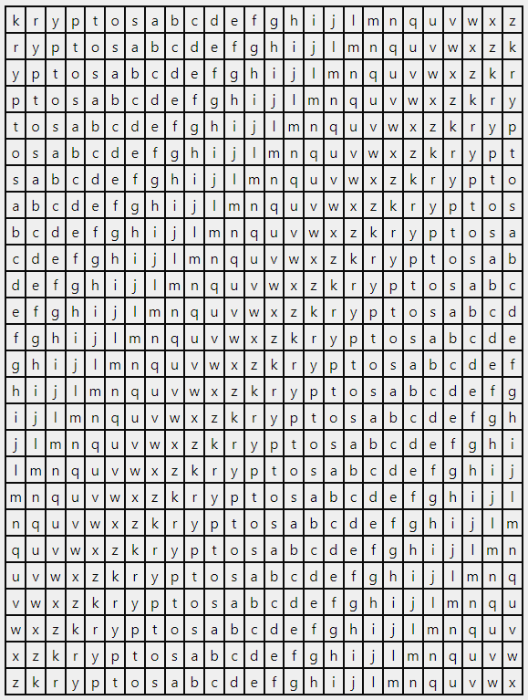

<h1><a href="https://vigenereverse.netlify.app/" target="_blank">Keyed Vigenere Cipher</a></h1

Let's first discuss what Vigenere Cipher is:
Vigenere Cipher is a type of encryption using a simple form of polyalphabetic substitution. It employs a keyword to shift letters of the plaintext.

Now, the Keyed Vigenere Cipher is similar to the standard Vigenère cipher but includes a keyword to generate a unique alphabet for each letter in the plaintext. This key influences the shifting patterns in a more intricate way than the traditional Vigenère cipher.


## How it works?

It needs 3 inputs from the user:
- Table Name
- Keyword
- Plaintext

| Input                      | Description                                                                                                         |
|----------------------------|---------------------------------------------------------------------------------------------------------------------|
| **Table Name**             | This can be left blank to use the standard English alphabet. If a word is entered, it will create a keyed alphabet. |
| **Plaintext/Secret Message** | The word or phrase you want to encrypt or decrypt.                                                                  |
| **Keyword**                | The key used for the encryption or decryption process.                                                               |


- Keyed Alphabet: is an alphabet that has been rearranged based on a keyword to create a unique substitution pattern for encryption or decryption processes. 
```
Example:
Table Name: kryptos
Keyword: hidden
Plaintext: secret message

Standard Alphabet: a b c d e f g h i j k l m n o p q r s t u v w x y z
Keyed Alphabet: k r y p t o s a b c d e f g h i j l m n q u v w x z

* since we have table name we will use the Keyed Alphabet *
```

## How does the Vigenere Table is generated?
```
The table is constructed by writing out the alphabet in the first row. For each subsequent row,
shift the starting point of the alphabet by one letter to the left, wrapping around to the beginning
of the alphabet after 'Z'. This means the second row starts with 'B', the third row starts with 'C',
and so on, until the last row starts with 'Z'. But in our case, first row starts with 'K', second row
with 'R', third row with 'Y', and so on.
```


## Generated Vigenere Table




## Generating Encrypted Text

It will first make sure that the keyword and the message is in the same length. 

```
In our case:
Plaintext: secret message
Keyword: hidden

The keyword is shorter than the secret message so the program will repeat the keyword to match the length of the message.

Plaintext: secretmessage
Keyword: hiddenhiddenh

* if the keyword is longer than the secret message the keyword will be truncated to match the length of the message *

```

Finally, the program will now iterate through each letter of the plaintext message. For each letter, it finds the corresponding letter of the keyword at the same position. Then, it looks up the intersection of the row labelled by this keyword letter and the column labelled by the plaintext letter in the Vigenère table.

For instance, for the first letter 's' in the plaintext and the first letter 'h' in the keyword, the program finds the intersection 'k'. It repeats this process for each letter in the plaintext and keyword pair until the entire message is encrypted.


In this case, the encrypted message for the </br>
plaintext "secret message" </br>
using the keyword "hidden" </br>
would be <b>"qknevwskjjmsz"</b>.

<p>Encrypt or Decrypt your Vigenere Cipher here:</p> 
<a href="https://vigenereverse.netlify.app/" target="_blank">Keyed Vigenere Cipher</a>

